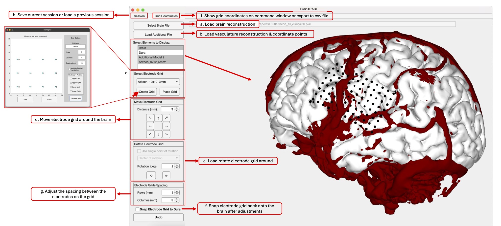

  

# BrainTRACE #

This is a MATLAB GUI for placing subdural ECoG grids on 3D brain models generated from
.pial or .mgz files. Program was created Abbey Roelofs, Michael Egan, Tyler Slouf, and
David Brang at the University of Michigan.

  

## Getting Started: Download and Install BrainTRACE

* Option A: Download a Compiled Desktop Application that does not require Matlab. Instead, the application uses Matlab Runtime (freely available). 

    * Windows:
        * Download link:  
        * Matlab Runtime and BrainTRACE are installed through this single .exe file

    * MAC:
        * Step 1. Download and install Matlab Runtime for R2024b. 
        * Note that you do not need Matlab to be installed. BrainTRACE was compiled using R2024b so it requires the same version of Matlab Runtime.

        * You can download Matlab Runtime from Matlab's website (https://www.mathworks.com/products/compiler/matlab-runtime.html) or the links below: 
        * Mac (Intel Processors): https://ssd.mathworks.com/supportfiles/downloads/R2024b/Release/5/deployment_files/installer/complete/maci64/MATLAB_Runtime_R2024b_Update_5_maci64.dmg.zip

        * Mac (arm64 Processors: M1, M2, M3, etc): https://ssd.mathworks.com/supportfiles/downloads/R2024b/Release/5/deployment_files/installer/complete/maca64/MATLAB_Runtime_R2024b_Update_5_maca64.dmg

        * Step 2. Download and install BrainTrace:
        * Mac (Intel Processors): 
        * Mac (arm64 Processors: M1, M2, M3, etc): 
        * This will create a folder called BrainTRACE in your /Applications/ folder. Run BrainTRACE.app
        * If the program cannot locate the installed Matlab RunTime directory it will ask you to locate it.

* Option B: Install BrainTRACE as a Matlab Application (Plug-In). This version is not public but is freely available to researchers on request. 
	* Please email BrangLabTools@umich.edu to request a download link.

    * To use the Matlab Plug-in:
    * Run the BrainTRACE.mlappinstall file, then select the BrainTRACE app from the MATLAB Apps bar.

    * This app was developed in MATLAB 2023b and has been tested in 2024b. It requires the MATLAB Statistics and Machine Learning Toolbox.

### Input Data

This program accepts .pial (including .pial.T1) or .mgz files as input to plot the brain model. In addition to modeling the surface defined by the model file, the program also calculates a smoothed shell (the dura surface, in biological terms) around the model and plots this as well. This smoothed surface is less complex and is considered to be the surface on which the electrode grid should be placed. 

A variety of test files can be found in the [DemoData](DemoData) folder. These files are as follows:
* brain_ANTs.mgz: Main .mgz brain model file, which has a lesion (gap) on one side.
* PostGad_BrainMask_Vasc.mgz: Additional vasculature model file for this brain model
* brainlab_coordinates.csv: When loaded in as an additional file, this will display points that were the corners of the grids obtained from the neuronavigation system. These operate as landmarks until we further develop the tool to place the grid using coordinates.
* lh.pial: This is the pial for the same patient as the above models using freesurfer's recon-all-clinical approach, which fills in lesions.
* brain.mgz: This is generated by recon-all-clinical. When loading the lh.pial into BrainGrid, it'll request an mgz file to find the RAS transformations. This file is needed for that step.

### Callback Error Workaround

Matlab has a bug that causes the following error message to occur when right-clicking on the listbox menu, the UI element where the active models and grids are displayed, in BrainGrid:

> Error in executing callback registered with ViewModel:
> Event 'ContextMenuOpening' is not defined for class 'matlab.graphics.GraphicsPlaceholder'.

MathWorks support provided these instructions as a workaround until the bug is fixed in a later release (still exists as of 2024a):

1. On MacOS go to the Applications folder
2. Right-click on your current Matlab version and select "Show Package Contents"
3. Navigate to `\matlab\toolbox\matlab\uitools\+matlab\+uitools\+internal\@uimode`
4. Replace the "modeWindowButtonDownFcn.m" file in the folder with [this file](https://drive.google.com/file/d/1SrY8PBhaYD2R5s-7rdvHCR49o9ybJL5J/view?usp=sharing)
5. If Matlab is open, restart the program

## Use Guide (detailed at LINK)

### Pre-Processing

BrainTRACE assumes that you have generated either a skull-stripped brain (e.g., the brain.mgz output from Freesurfer) or a pial file (e.g., lh.pial from Fressurfer). We recommend using the recon-all-clinical (https://surfer.nmr.mgh.harvard.edu/fswiki/recon-all-clinical) pipeline to generate these files. We additionally have provided scripts in the [HelperFunctions](HelperFunctions) folder to register/reslice MRIs and to extract a vasculature mask. Warning that these tools are minimally documented.

### Add a model

"Select Model File" adds the initial brain model to the window; this is the model that will be used in calculating the dura surface and placing electrode grids. "Load Additional Model" can be used to add a second .pial or .mgz file to the display. This is useful, for example, for adding a model of blood vessels on the brain surface, which can be a useful reference in determining electrode locations. Model files added with this button will _not_ have an associated dura surface.

### Add dura surface

BrainTRACE generates an estimate of the dura surface as the surface boundary of the brain. ECoG electrodes are then placed in relation to the dura as opposed to the brain’s surface. This is necessary as electrodes may otherwise fall into sulcal gaps. The dura is updated once the brain reconstruction image is adjusted for an optimal view of the sulcal anatomy. The GUI will prompt users to create dura automatically after loading a reconstruction or users may load an externally created dura surface. Alternatively, this step may be completed by right-clicking on the brain file within “select elements to display” and selecting “create dura.” The software will prompt the user for a dura shrink factor ranging from 0 to 1 and corresponding to the ‘shrink factor’ of the MATLAB ‘boundary’ function. The software computes the value automatically, and thus, the user does not need to adjust this value. Once users no longer need to view the dura, they may hide it by deselecting the dura element.  

Externally generated surfaces can be loaded here. The Make_Dura folder in [HelperFunctions](HelperFunctions) provides one option for this using the bash commands:
* export PATH=$PATH:FOLDER_LOCATION/HelperFunctions/Make_Dura
* make_dura_surface_reduce -i lh.pial
You should replace FOLDER_LOCATION with the full path to HelperFunctions
lh.pial reflects the freesurfer generated surface

### Select/Remove/Alter items

Only items selected in the 'Select Elements to Display' box will be shown in the model view. To display multiple items, hold the Command (on a Mac) or Control (in Windows) key while clicking on item names. Individual elements of the display can be deleted by right-clicking the element name in the 'Select Elements to Display' box. This brings up a menu that includes a delete option, as well as options to rename, change the color, alter the degree of transparency of a model, and (in the case of .mgz brain model files, which are a point cloud of values) change the threshold used in determining which points comprise the brain. Electrode grid elements on this list will also have an option to relocate the grid; this allows repositioning from the initial step rather than using the move buttons.

### Grids

**General**

The "Create Grid" button allows the creation and saving of new electrode grid models. Each grid has a number of rows, number of columns, spacing between electrodes, and the option to click electrodes to remove them and leave blank spaces in the grid. Grids are saved to an application data folder located at $HOME/Documents/MATLAB/braingrid/grids as MAT-files. Once a grid is saved, it can be added to the model view.

**Placement**

Electrode grids are placed either by entering coordinates for one (or more) of their constituent points or by clicking a location on the brain model where the grid should be placed. When clicking a point, the upper left corner electrode will be placed at this point. Points do not always end up exactly where they were placed, as after each placement (or move), the grid is re-fit to the dura surface, which can cause slight shifts.

**Multiple Grids**

Multiple grids can be placed on the model; by default, the most recently added grid will be active and have a * after its name. Only the active grid will be affected by the move and rotate buttons. To change the active grid, select the desired new active grid name in the 'Select Elements to Display' box, right click, and choose 'Make Active Grid'. Note that this option will not be shown if multiple grids are selected; the current active grid must be de-selected in order to change active grids.

**Exporting Grid Coordinates**

'Show Grid Coordinates' will display the current grid coordinates in the MATLAB command window. 'Export Grid Coordinates' will export the coordinates to a file.

**Snap to Grid**
There is a checkbox to snap the grid to the dura surface. The grid can be moved with or without the checkbox checked. With the box unchecked, grid movements are faster because fewer calculations are performed between moves. Checking the box will automatically start the snap-to-grid process.

This operation can take a long amount of time depending on how far the grid has to move, or how large the grid is. A warning will be shown if a specified amount of time is exceeded during the operation and the grid will remain in its initial position.

### Sessions

"Session... > Save..." saves the current state of the application to a session data file. The user is prompted to specify a file name and destination. The destination defaults to an application data folder located at $HOME/Documents/MATLAB/braingrid/sessions. The session data file contains the following information for each model: name, color, file path (brain and additional models only), isovalue (.mgz file models only), and the brain model dura wrap factor. Electrode grid models also retain their placement history.

"Session... > Load..." restores the state of the application from a session data file. The user is prompted to select a file to load. The application will try to locate the files for the brain and additional models using the file paths that pointed to them during the original session. If it cannot locate a model file, the user to prompted to search for it before continuing. If the user cannot locate the file for the brain model, the load is canceled. If the user cannot locate the file for an additional model, the application skips to the next model. Models loaded from .mgz files will be restored using the same isovalues used during the original session. The brain dura surface is regenerated using the same dura wrap factor used during the original session.

The current application state is cleared before trying to load session data files.

## Helper Tools

* https://github.com/dbrang/IntraOp_Image_Registration_Tools
    * Open-source tools for aligning and registering intraoperative photographs captured from different positions and angles
*  Make_Dura can be used to generate a dura surface
*  Tumor_Grid_Preprocessing.m can be used to register patient MRIs, generate skull-stripped files, and vasculature 

## Contacts

* BrangLabTools@umich.edu 

## License: Polyform Noncommercial 1.0.0 (see LICENSE file for details)
